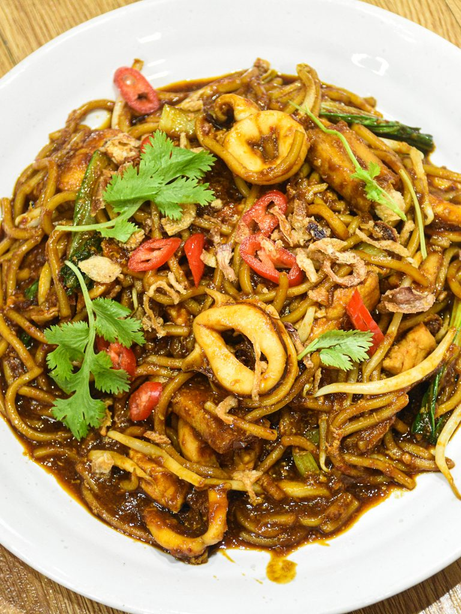

# DevOps-Project

Make sure to have a __GitHub account__ and __Git installed__.

# 1. Git Repository & Version Control:

**Amir:**
1. Create repository in GitHub named 'DevOps-Project'
2. Clone the repository: ```git clone https://github.com/ashahmi/DevOps-Project.git```
3. Create **index.html** that contains the following content:  
   ```
   <!DOCTYPE html>
    <html lang="en">
    <head>
        <meta charset="UTF-8">
        <meta name="viewport" content="width=device-width, initial-scale=1.0">
        <title>DevOps</title>
    </head>
    <body>
        <h1>Best Traditional Food in Malaysia</h1>
        <div>
            <p>1. Nasi Lemak</p>
        </div>
        <div>
            <p>2. Satay</p>
        </div>
        <div>
            <p>3. Mee Goreng</p>
        </div>
        <div>
            <p>4. Laksa</p>
        </div>
        <div>
            <p>5. Rendang</p>
        </div>
    </body>
    </html>
   ```
4. Commit and Push Changes:  
   ```
   git add *
   git commit -m "Initial commit: Addex index.html, updated README.md"
   git push origin main
   ```

**Aqif:** 
1. Fork repository from github: https://github.com/ashahmi/DevOps-Project.git
2. Clone it to local: ```git clone https://github.com/ashahmi/DevOps-Project.git```
3. Formats the **index.html** to center and adds background color:
   ```
      <!DOCTYPE html>
      <html lang="en">
      <head>
          <meta charset="UTF-8">
          <meta name="viewport" content="width=device-width, initial-scale=1.0">
          <title>DevOps</title>
      </head>
      <body style="background-color: brown">
          <center>
          <h1>Best Traditional Food in Malaysia</h1>
          <div>
              <p>1. Nasi Lemak</p>
          </div>
          <div>
              <p>2. Satay</p>
          </div>
          <div>
              <p>3. Mee Goreng</p>
          </div>
          <div>
              <p>4. Laksa</p>
          </div>
          <div>
              <p>5. Rendang</p>
          </div>
          </center>
      </body>
      </html>
   ```
4. Stage, commit, and push changes:
   ```
   git add *
   git commit -m "Formatted to center and added background color"
   git push origin main
   ```
5. Create Pull Request

**Iman:**

1. Fork and clone repository from github **(followed previous steps)**
2. Created folder 'assets' and added images inside it in local:
   ```./assets```
   >Mee.jpg
   
   >laksa.jpg
   
   >nasi-lemak.jpg
   
   >rendang.jpg
   
   >satay.jpg
3. Added the images in ```index.html```
   ```
   <!DOCTYPE html>
   <html lang="en">
   <head>
       <meta charset="UTF-8">
       <meta name="viewport" content="width=device-width, initial-scale=1.0">
       <title>DevOps</title>
   </head>
   <body style="background-color: brown">
       <center>
       <h1>Best Traditional Food in Malaysia</h1>
       <div>
           
           <p>1. Nasi Lemak</p>
       </div>
       <div>
           
           <p>2. Satay</p>
       </div>
       <div>
           
           <p>3. Mee Goreng</p>
       </div>
       <div>
           
           <p>4. Laksa</p>
       </div>
       <div>
           
           <p>5. Rendang</p>
       </div>
       </center>
   </body>
   </html>
   ```
4. Stage, commit, and push changes:
   ```
   git add *
   git commit -m "Formatted to center and added background color"
   git push origin main
   ```
5. Create Pull Request

**Amir:**

1. Merge pull request

# 2. CI/CD Pipeline Setup

**Aqif:**

1. Sync the main repository
2. Update local: ```git pull origin main```
3. Made github workflow directory: ```mkdir -p .github/workflows/```
4. Created ```github-actions-ec2.yml``` inside the directory with these:
   ```
   name: Push-to-EC2

   # Trigger deployment only on push to main branch
   on:
     push:
       branches:
         - main
   
   jobs:
     deploy:
       name: Deploy to EC2 on master branch push
       runs-on: ubuntu-latest
   
       steps:
         - name: Checkout the files
           uses: actions/checkout@v2
   
         - name: Deploy to Server 1
           uses: easingthemes/ssh-deploy@main
           env:
             SSH_PRIVATE_KEY: ${{ secrets.EC2_SSH_KEY }}
             REMOTE_HOST: ${{ secrets.HOST_DNS }}
             REMOTE_USER: ${{ secrets.USERNAME }}
             TARGET: ${{ secrets.TARGET_DIR }}
   
         - name: Executing remote ssh commands using ssh key
           uses: appleboy/ssh-action@master
           with:
             host: ${{ secrets.HOST_DNS }}
             username: ${{ secrets.USERNAME }}
             key: ${{ secrets.EC2_SSH_KEY }}
             script: |
               sudo apt-get -y update
               sudo apt-get install -y apache2
               cd home
               sudo mv * /var/www/html
               sudo systemctl start apache2
               sudo systemctl enable apache2
   ```
5. Stage, commit, and push changes:
   ```
   git add *
   git commit -m "Formatted to center and added background color"
   git push origin main
   ```
6. Create Pull Request

**Amir:**

1. Merge pull request
2. Added ***EC2_SSH_KEY*** to repository secrets
3. Update local repository: ```git pull origin main```
4. Testing workflow (edited ```index.html```):
   ```
   <!DOCTYPE html>
   <html lang="en">
   
   <head>
       <meta charset="UTF-8">
       <meta name="viewport" content="width=device-width, initial-scale=1.0">
       <title>DevOps</title>
   </head>
   
   <body style="background-color: brown">
       <center>
       <h1><u>Best Traditional Food in Malaysia</u></h1>
   
       <div>
           
           <p>1. Nasi Lemak</p>
       </div>
   
       <div>
           
           <p>2. Satay</p>
       </div>
   
       <div>
           
           <p>3. Mee Goreng</p>
       </div>
   
       <div>
           
           <p>4. Laksa</p>
       </div>
   
       <div>
           
           <p>5. Rendang</p>
       </div>
       </center>
   </body>
   
   </html>
   ```
5. Verified by succesfully accessed the web browser: [Best Malaysian Foods](http://52.90.86.85/)

# 3. Containerization

Make sure to have **Docker dekstop** installed

**Adam:**

1. Sync the main repository
2. Updated to local: ```git pull origin main```
3. Created ```Dockerfile``` with these:
   ```
   FROM nginx:latest

   COPY . /usr/share/nginx/html/
   
   EXPOSE 80
   ```
4. Built docker image: ```docker build -t index-page .```
5. Verifying by running docker container and opened **localhost**:  
   ```docker run -d -p 8080:80 --name BestFood index-page```
6. Stage, commit, and push changes:
   ```
   git add *
   git commit -m "Added dockerfile"
   git push origin main
   ```
7. Create Pull Request

**Amir:**

1. Merge pull request
